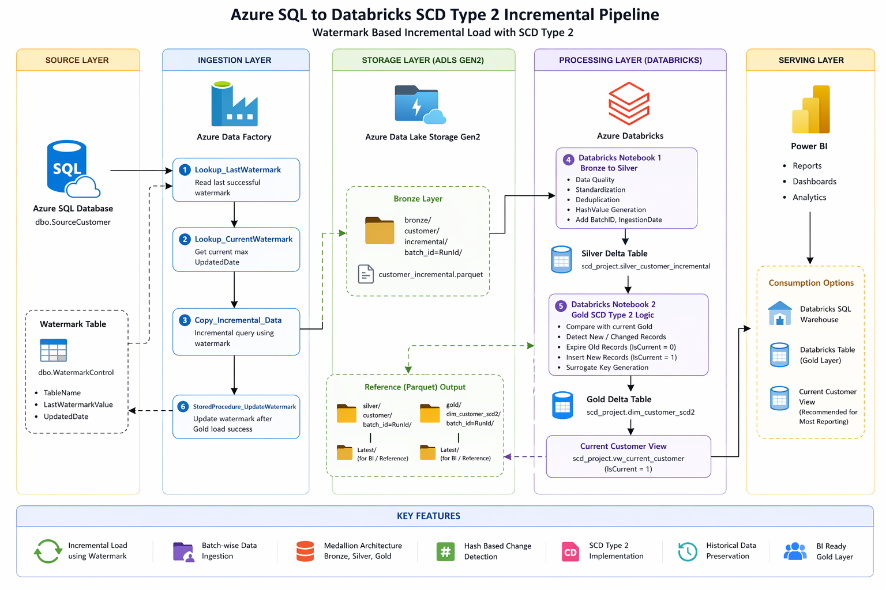

# SCD Type 2 Incremental Pipeline — Azure End-to-End

> An end-to-end Azure Data Engineering pipeline that uses **watermark-based incremental loading** to extract only changed customer records from Azure SQL Database, and applies **Slowly Changing Dimension (SCD) Type 2** logic in Databricks to preserve the full history of every change over time.

---

## 📌 Overview

Most source systems don't tell you what changed — they just reflect the current state. This pipeline solves that by using a watermark (the `LastModifiedDate` column on the source table) to detect only new or updated records since the last run, avoiding expensive full-table reloads.

Once the incremental batch lands in the data lake, Databricks applies SCD Type 2 logic: old versions of changed records are expired, and new versions are inserted — giving analysts a complete, auditable history of every customer record change.

> **Why watermark and not CDC?**
> Watermark-based loading works on any database that has a reliable `LastModifiedDate` column — no special database features required. It's simpler to set up and portable across platforms. CDC (used in the companion [CDC Data Pipeline](https://github.com/Simha-manoranjan-reddy/cdc-data-pipeline) repo) is more precise — it captures deletes and uses SQL Server's internal log — but requires SQL Server and CDC to be enabled. Both are valid strategies; watermark is the right choice when you control the source schema and want broad compatibility.

---

## 🏗️ Architecture



---

## 💼 Business Problem

Organizations need a complete history of changes to customer records for audit trails, regulatory compliance, and point-in-time reporting — but reloading the entire table on every run is slow and expensive.

This pipeline addresses that by:

- Loading only new and modified records each run using a watermark timestamp
- Preserving every historical version of a customer record using SCD Type 2
- Supporting point-in-time queries ("what did this customer record look like on date X?")
- Keeping the pipeline idempotent — safe to rerun without producing duplicates

---

## 🛠️ Technology Stack

| Service | Purpose |
|---|---|
| Azure SQL Database | Source system — customer records with `LastModifiedDate` |
| Azure Data Factory | Orchestration — watermark lookup, incremental copy, stored proc call |
| Azure Data Lake Storage Gen2 | Raw (Bronze) and processed (Silver/Gold) data storage |
| Azure Databricks | SCD Type 2 transformation logic via PySpark and Delta Lake MERGE |
| Delta Lake | ACID-compliant storage format enabling reliable MERGE operations |
| Azure Key Vault | Secrets management — connection strings, storage keys |

---

## 🔁 Pipeline Workflow

```
Azure SQL Database  (source: customer table with LastModifiedDate)
        ↓
ADF — Lookup activity reads LastWatermark from watermark table
        ↓
ADF — Copy activity extracts rows WHERE LastModifiedDate > LastWatermark
        ↓
ADLS Gen2 — Bronze layer (raw incremental batch as Parquet)
        ↓
Databricks Notebook 1 — Bronze → Silver (clean, cast, validate)
        ↓
Databricks Notebook 2 — Silver → Gold (SCD Type 2 MERGE into Delta)
        ↓
ADF — Stored procedure updates watermark to current max LastModifiedDate
```

> **Critical ordering:** The watermark is updated **last**, only after both Databricks notebooks succeed. If either notebook fails, the watermark stays at the previous value and the same batch is safely retried on the next run — no data loss, no skipped records.

---

## ⚙️ SCD Type 2 Implementation

The Gold layer Delta table maintains a full version history using three tracking columns:

| Column | Type | Description |
|---|---|---|
| `surrogate_key` | bigint | Auto-generated unique key per version row |
| `StartDate` | date | Date this version became active |
| `EndDate` | date | Date this version was superseded (`NULL` if still current) |
| `IsCurrent` | string | `Y` = active record, `N` = expired historical record |

When a customer record changes, the pipeline performs a two-step MERGE:

1. **Expire** the existing active row — set `EndDate = today`, `IsCurrent = 'N'`
2. **Insert** the new version — set `StartDate = today`, `EndDate = NULL`, `IsCurrent = 'Y'`

New records (no existing row) are inserted directly as `IsCurrent = 'Y'`.

---

## 📊 Sample SCD Type 2 Output

**Source record — Day 1:**

| CustomerID | CustomerName | City |
|---|---|---|
| 101 | John Doe | Hyderabad |

**Source record — Day 2 (city changed):**

| CustomerID | CustomerName | City |
|---|---|---|
| 101 | John Doe | Bangalore |

**Gold dimension table after Day 2 run:**

| surrogate_key | CustomerID | CustomerName | City | StartDate | EndDate | IsCurrent |
|---|---|---|---|---|---|---|
| 1 | 101 | John Doe | Hyderabad | 2025-01-01 | 2025-06-01 | N |
| 2 | 101 | John Doe | Bangalore | 2025-06-01 | NULL | Y |

Both versions are retained. Analysts can query `WHERE IsCurrent = 'Y'` for current state, or join on date ranges for point-in-time reporting.

---

## 🗂️ Repository Structure

```
SCD-Type-2-Incremental-Pipeline/
│
├── Architecture/
│   └── Designer.png                          ← Architecture diagram
│
├── adf/
│   ├── Designer(1).png                       ← ADF pipeline screenshot
│   └── pipeline_overview.md                  ← ADF pipeline documentation
│
├── notebooks/
│   ├── 01_bronze_to_silver_incremental.ipynb ← Clean & cast raw batch to Silver
│   └── 02_silver_to_gold_scd2.ipynb          ← SCD Type 2 MERGE into Gold Delta
│
├── SQL Queries/
│   ├── SourceScripts/
│   │   ├── create_source_customer_table.sql
│   │   ├── insert_day1_data.sql
│   │   ├── update_day2_data.sql
│   │   └── update_day3_data.sql
│   └── WatermarkScripts/
│       ├── create_watermark_table.sql
│       ├── create_update_watermark_sp.sql
│       └── validation_queries.sql
│
└── README.md
```

---

## 🚀 Setup & Deployment

### Prerequisites

- Azure subscription with Contributor access
- Azure SQL Database with a source table containing a `LastModifiedDate` (or equivalent) column
- Azure Data Lake Storage Gen2 account
- Azure Databricks workspace (Standard or Premium tier)
- Azure Data Factory instance
- Azure Key Vault for secrets

### 1. Set Up Source Database

Run the scripts in `SQL Queries/SourceScripts/` against your Azure SQL Database in order:

```sql
-- 1. Create the source customer table
-- create_source_customer_table.sql

-- 2. Insert Day 1 seed data
-- insert_day1_data.sql
```

### 2. Set Up Watermark Table

Run the scripts in `SQL Queries/WatermarkScripts/`:

```sql
-- Creates the watermark control table
-- create_watermark_table.sql

-- Creates the stored procedure ADF calls to advance the watermark
-- create_update_watermark_sp.sql
```

The watermark table holds one row per source table:

| TableName | LastWatermark |
|---|---|
| customer | 2025-01-01 00:00:00 |

### 3. Configure ADLS Gen2

Create the following container structure:

```
your-container/
├── bronze/    ← raw incremental batches from ADF
├── silver/    ← cleaned Delta tables
└── gold/      ← SCD Type 2 dimension tables
```

### 4. Deploy ADF Pipeline

1. Import the pipeline from the `adf/` folder via ADF Git integration or ARM template import.
2. Update linked services to point to your SQL Database and ADLS account — use Key Vault references, never hard-code credentials.
3. Set pipeline parameters: `storageAccountName`, `containerName`, `sqlServerName`, `databaseName`.

### 5. Deploy Databricks Notebooks

1. Import notebooks from `notebooks/` into your Databricks workspace.
2. Use Databricks Runtime 12.x or above (Delta Lake 2.x).
3. Configure notebook parameters: `bronze_path`, `silver_path`, `gold_path`.

### 6. Run the Pipeline

Trigger the ADF pipeline manually for the first run, then set a schedule trigger (e.g. daily at midnight). Each run will:

1. Look up `LastWatermark` from the watermark table
2. Copy only rows where `LastModifiedDate > LastWatermark` to Bronze
3. Run Notebook 1 (Bronze → Silver)
4. Run Notebook 2 (Silver → Gold SCD2 MERGE)
5. Call the stored procedure to advance the watermark

---

## 🔐 Security Notes

- Store all connection strings and storage keys in Azure Key Vault.
- ADF linked services should reference Key Vault secrets, not contain credentials directly.
- The Databricks service principal should have `Storage Blob Data Contributor` on the ADLS account only — not broader access.
- Never commit credentials or storage account keys to this repository.

---

## 🎯 Design Decisions

**Watermark stored in SQL, not ADF pipeline variables** — Pipeline variables are lost if a run is cancelled or the ADF service restarts. A SQL table persists across failures and can be inspected or manually corrected without touching ADF.

**Watermark updated last, after all transformations succeed** — This is the key reliability guarantee. If Databricks fails, the watermark stays at the previous value and the same batch is retried next run. Delta Lake's ACID guarantees mean a partial Databricks write is never committed, so retrying is always safe.

**SCD Type 2 uses a surrogate key** — Natural keys like `CustomerID` appear multiple times in the dimension table (once per version). A `surrogate_key` gives fact tables an unambiguous foreign key to join on, without needing to know which version was current at a given date.

**Separate Bronze → Silver → Gold notebooks** — Separating cleaning (Silver) from business logic (Gold) means if the SCD2 logic needs to change, you can rerun just Notebook 2 from the existing Silver data without re-ingesting from the source.

---

